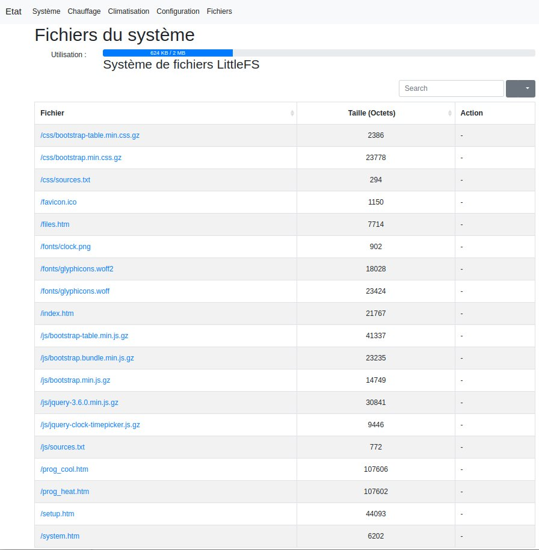

# WifiThermostat
WifiThermostat for ESP8266 or ESP32
- Serveur Web pour la configuration et le suivi (multilangue fançais anglais)
  - Changement de langue automatique en fonction de la langue de votre navigateur
- Accès avec le nom réseau e.g. http://<nom réseau>.local/
- Support °C ou °F (celsius ou fahrenheit)
- Données stockées dans le système de fichier LittleFS 
- Configuration du réseau Wifi en se connectant au thermostat avec un téléphone mobile
- Paramétrage de la Time zone pour avoir la bonne heure
  - Paris : CET-1CEST,M3.5.0,M10.5.0/3
- Gestion automatique de l'heure été/hiver via la Time Zone configurée
- Paramètrage du serveur de temps (ntp)
- 28 plages horaires au total
- Chaque plage peut être attribuée à 1 ou plusieurs jours (jusqu'à 7)
  - Une plage peut être affectée à un seul jour
  - Une plage peut être affectée du Lundi au Vendredi
  - Une plage peut être affectée au Week End
  - Pour un plage on coche les jours concernés
- Envoi possible des données à un serveur MQTT
- Envoi possible d'un requète http
- Mise à jour via OTA (Wifi) 

# Hardware

## Temperature sensors

|   Module       |  Mesures               |  Communication   |  Value         |   Precision          |   Image                                                                                |    Comment     |
|----------------|------------------------|------------------|----------------|----------------------|----------------------------------------------------------------------------------------|----------------|
| BME 280       | Temperature / Humidity  | I2C (0x76) ou SPI| -40 à +85 °C   |                      | [BME280](docs/sensors-BME280.jpg)  [schematics](docs/sensors-BME280-schematics.jpg) | Supported      |
| DS18B20       |  Temperature Only       | OneWire          | -55 à +125 °C  | 12bits / 0,0625°C    | [DS18B20](docs/sensors-DS18B20.jpg)                                                    | Supported      |
| HTU21         | Temperature / Humidity  | I2C (0x40)       | -40˚C à +125˚C | ±0.3˚C at 25°C       | [HTU21](docs/sensors-HTU-21.jpg)   [schematics](docs/sensors-HTU21-schematics.jpg)  | Supported      |
| -             |                         |                  |                |                      |                                                                                        |                |
| BMP 280       |  Temperature Only       |  I2C             |  0 à 65 °C     |                      |                                                                                        | Non implémenté |
| GY-BME/BMP280 | Temp / Hum / Barometric |  I2C et SPI      | -40 à +85 °C   | 0,01 ° C             |                                                                                        | Non implémenté |
| BME 680       | Temp/Hum/Baro/gaz       |  I2C et SPI      |                |                      |                                                                                        | Non implémenté |

## Connection

|    Module         | Module Pin |  ESP82666   ESP12E/ESP12F | ESP8266   WEMOS D1 Mini| ESP32   ESP32 30 pin |  ESP32   ESP32-C6 Mini |
|-------------------|------------|--------------|--------------|---------------|---------------|
| HI-LINK           | -Vo        | G            | G            | GND           |  GND          |
| HI-LINK           | +Vo        | VIN          | 5V           | VIN           |  +5V          |
|       -           |            |              |              |               |               |
| BME/BMP280        | SCL        | GPIO 5 (D1)  | GPIO 5 (D1)  | GPIO 22 (D22) | GPIO 23 (D5)  |
| BME/BMP280        | SDA        | GPIO 4 (D2)  | GPIO 4 (D2)  | GPIO 21 (D21) | GPIO 22 (D4)  |
|      or           |            |              |              |               |               |
| GY-BME/BMP280     | SCL        | GPIO 5 (D1)  | GPIO 5 (D1)  | GPIO 22 (D22) | GPIO 23 (D5)  |
| GY-BME/BMP280     | SDA        | GPIO 4 (D2)  | GPIO 4 (D2)  | GPIO 21 (D21) | GPIO 22 (D4)  |
|      or           |            |              |              |               |               |
| BME 680           | SCK        | GPIO 5 (D1)  | GPIO 5 (D1)  | GPIO 22 (D22) | GPIO 23 (D5)  |
| BME 680           | SDI        | GPIO 4 (D2)  | GPIO 4 (D2)  | GPIO 21 (D21) | GPIO 22 (D4)  |
|      or           |            |              |              |               |               |
| HTU21             | SCL        | GPIO 5 (D1)  | GPIO 5 (D1)  | GPIO 22 (D22) | GPIO 23 (D5)  |
| HTU21             | SDA        | GPIO 4 (D2)  | GPIO 4 (D2)  | GPIO 21 (D21) | GPIO 22 (D4)  |
|      or           |            |              |              |               |               |
| DS18B20           |  DQ        | GPIO 13 (D7) | GPIO 13 (D7) | GPIO 15 (D15) | GPIO 15 (D15) |
|                   |            |              |              |               |               |
| RELAY (NO)        | IN1        | GPIO 12 (D6) | GPIO 12 (D6) | A5 (GPIO 33)  | idem ?        |
| RUF RELAY N°2     | IN1        | GPIO 14 (D5) | GPIO 14 (D5) |               |               |

- HI-LINK : HLK-PM01 : INPUT 100-240VAC 50-60Hz : OUTPUT 5VDC 3W
- BME/BMP280 BME 680 : (GND -> GND ; VCC -> 3.3V) 
- HTU21              : (GND -> GND ; VCC -> 3.3V) 
- RELAY              : 5V Relay Module (DC- -> -Vo ; DC+ -> +Vo)
  - Attention ESP ne supporte pas 5V : les relais 5V commandés pas un niveau bs ne conviennent pas

- Possible ajout petit afficheur OLED en SPI (SDA,SCL)

Sous réserve de tests

## ESP8266 12E/12F

[esp8266 12e 12f](docs/esp12e-gpio.png)

[esp8266 HTU21 connections](docs/ESP12e-gpio-htu21.jpg)

[esp8266 DS18B20 connections](docs/ESP12e-gpio-ds18b20.jpg)

## ESP8266 WEMOS D1 Mini

[Wemos D1 Mini](docs/WEMOS-D1-Mini.jpg)

[Wemos D1 Mini BME280 connections](docs/WEMOS-D1-Mini-gpio-bme280.jpg)

## ESP32 30 Pins

[esp32 gpio](docs/ESP32-dev-kit-30pins-pinout.png)

## ESP32-C6 

[esp32-C6](docs/ESP-C6-Mini.png)

[esp32-C6 HTU connections](docs/ESP32-C6-gpio-htu21.jpg)

# Software
|       Nom     |      Localisation         | Version |  Nom ou Lien                                                                                    |   Commentaire    | Voir | 
|---------------|---------------------------|---------|-------------------------------------------------------------------------------------------------|------------------|------|
| Arduino IDE   | Desktop                   | V1.8.18 |                                                                                                 | Pas version 2.x  | (1)  |
| Ardiuno IDE   | Fichiers/Préférences      |         | http://arduino.esp8266.com/stable/package_esp8266com_index.json                                 | Pour ESP8266     | (2)  |
| Ardiuno IDE   | Fichiers/Préférences      |         | https://espressif.github.io/arduino-esp32/package_esp32_index.json                              | Pour ESP32       | (2)  |
| Arduino IDE   | Dossier Arduino/tools     | V0.5.0  | https://github.com/esp8266/arduino-esp8266fs-plugin/releases/download/0.5.0/ESP8266FS-0.5.0.zip | Pour ESP8266     | (3)  |
| Arduino IDE   | Dossier Arduino/tools     | V2.0.7  | https://github.com/lorol/arduino-esp32fs-plugin/releases/download/2.0.7/esp32fs.zip             | Pour ESP32       | (4)  |
| Arduino IDE   | Dossier Arduino/libraries |         | https://github.com/Pedroalbuquerque/ESP32WebServer                                              | Pour ESP32       | (5)  |
| Arduino IDE   | Dossier Arduino/libraries |         | WifiThermostat/librairie/Syslog-master.zip                                                      |                  | (5)  |
| Arduino IDE   |                           | V2.3.8  | OneWire                                                                                         | only for DS18B20 | (6)  |
| Arduino IDE   |                           | V4.0.3  | DallasTemperature                                                                               | only for DS18B20 | (6)  |
| Arduino IDE   |                           | V2.2.4  | Adafruit BME280 Library                                                                         | only for BME280  | (6)  |
| Arduino IDE   |                           | V1.1.2  | Adafruit HTU21D                                                                                 | only for HTU21   | (6)  |
| Arduino IDE   |                           | V1.17.0 | Adafruit BusIO                                                                                  |                  | (6)  |

- (1) ESP8266 et ESP32 Skech Data Upload ne fonctionnent pas sur version 2.x
- (2) Ajouter les deux même si vous ne l'utilisez pas
- (2) Séparer les liens pas une virgule
- (2) Ne pas oublier d'aller dans le gestionnaire de cartes et d'installer : esp8266 by ESP8266 community v3.1.2
- (2) Ne pas oublier d'aller dans le gestionnaire de cartes et d'installer : esp32 by Espressif Systems v3.1.1
- (2) Après avoir relancé Arduino IDE vous devriez avoir dans le menu Outils/Type de carte 'ESP8266 Boards (3.1.2)' et 'ESP32 Arduino'
- (3) A décompresser dans le répertoire du disque Arduino/tools qui est situé à côté du répertoire Arduino/libraries (Créer le répertoire tools s'il n'existe pas)
- (3) Après avoir relancé Arduino IDE vous devriez avoir dans le menu Outils 'ESP8266 Sketch Data Upload'
- (4) A décompresser dans le répertoire du disque Arduino/tools qui est situé à côté du répertoire Arduino/libraries (Créer le répertoire tools s'il n'existe pas)
- (4) Après avoir relancé Arduino IDE vous devriez avoir dans le menu Outils vous devez avoir 'ESP32 Sketch Data Upload'
- (5) A décompresser dans le répertoire du disque Arduino/libraries
- (6) A installer que si l'on utilise ce capteur (option de compilation dans WifiTherm.h)
- (6) A installer depuis l'Arduino IDE Outils/Gérer les bibliothèques

# Web interface

## Etat du thermostat

### Français en °C celsius

### Anglais en °F fahrenheit

## Données du système

## Programme de chauffage

## Fichiers du système

# Outils à installer (optionnel)
Pour le debug des exceptions qui apparaitrait dans 'Outils/Moniteur série'

Cela permet de convertir les valeurs hexadécimales en nom et numéro de ligne du code source

## Installation
|       Nom     |      Localisation         | Version  |  Nom ou Lien                                                                                           |   Commentaire   | Voir | 
|---------------|---------------------------|----------|--------------------------------------------------------------------------------------------------------|-----------------|------|
| Arduino IDE   | Desktop                   | V1.8.18  |                                                                                                        | Pas version 2.x | (1)  |
| Arduino IDE   | Dossier Arduino/tools     | V2.0.0   | https://github.com/me-no-dev/EspExceptionDecoder/releases/download/2.0.0/EspExceptionDecoder-2.0.0.zip | Pour ESP8266    | (1)  |
| Arduino IDE   | Dossier Arduino/tools     | V2.0.3   | https://github.com/me-no-dev/EspExceptionDecoder/releases/download/2.0.3/EspExceptionDecoder-2.0.3.zip | Pour ESP32      | (1)  |

- (1) Ne peuvent pas être installés simultanément car il sont dans le même répertoire (c'est l'un ou l'autre)

## Utilisation
- Il faut absolument compiler votre Croquis (sinon il vous demandera de sélection un fichier elf)
- Ouvrir le fenêtre Outils/ESP Exception Decoder (qui s'ouvrira sans poser de question)
- Et coller dans cette fenêtre le message d'exception
