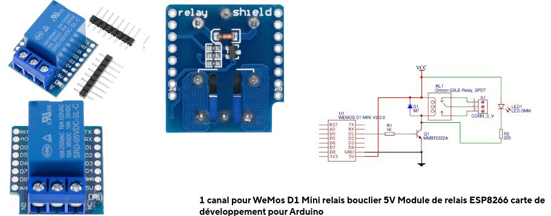
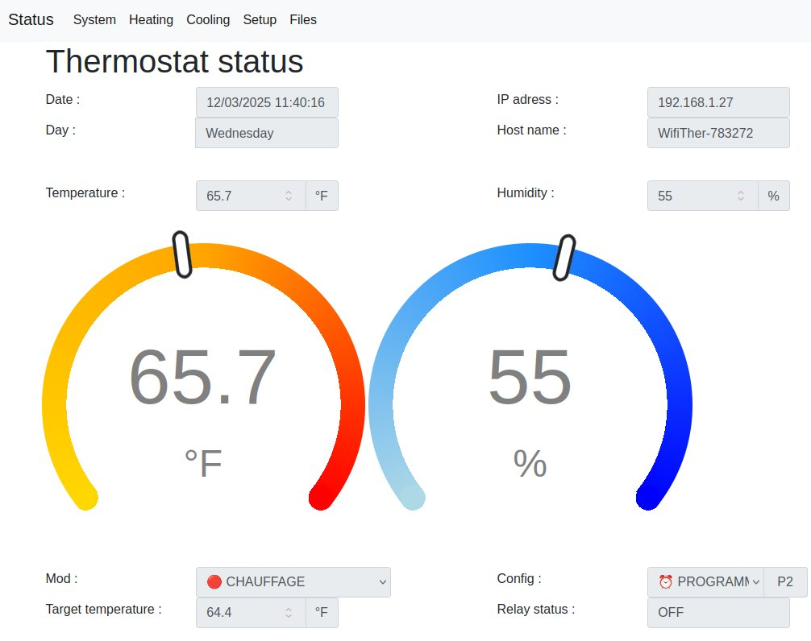
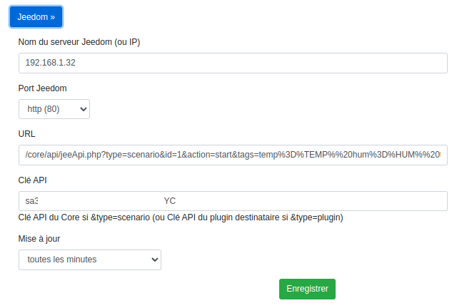

# WifiThermostat
WifiThermostat for ESP8266 or ESP32
- Serveur Web pour la configuration et le suivi (multilangue français anglais)
  - Changement de langue automatique en fonction de la langue de votre navigateur
- Accès avec le nom réseau e.g. http://<nom réseau>.local/
- Support °C ou °F (celsius ou fahrenheit)
- Données stockées dans le système de fichier LittleFS 
- Configuration du réseau Wifi en se connectant au thermostat avec un téléphone mobile
- Paramétrage de la Time zone pour avoir la bonne heure : exemples
  - Paris DST : "CET-1CEST,M3.5.0,M10.5.0/3"
  - British DST : "GMT0BST,M3.5.0/01,M10.5.0/02"
  - Eastern Standard Time : "EST5EDT,M3.2.0/2,M11.1.0"
  - Indian Standard Time : "UTC-05:30"
  - China Standard Time : "CST-8CDT-8,M4.2.0/2,M9.2.0/3"
- Gestion automatique de l'heure été/hiver via la Time Zone configurée
- Paramètrage du serveur de temps (ntp)
- 4 modes de fonctionnement :
  - off : le thermostat est arrếté
  - antifrost : le thermostat maintient la température anti gel paramétrée dans la config
  - heat : le thermostat est en mode chauffage (activation relais si température en dessous de la consigne)
  - cool : le thermostat est en mode climatisation (activation relais si température en dessus de la consigne)
- 2 configurations :
  - manu : la consigne est fixe et celle programmé dans la config
  - prog : la consigne est fixé par le programme 
- 2 programmes : un pour le chauffage et un programme pour la climatisation
- 28 plages horaires par programme
- Chaque plage peut être attribuée à 1 ou plusieurs jours (jusqu'à 7)
  - Une plage peut être affectée à un seul jour
  - Une plage peut être affectée du Lundi au Vendredi
  - Une plage peut être affectée au Week End
  - Pour un plage on coche les jours concernés
- Si aucune plage ne correspond, c'est la température par défaut du programme qui est utilisée
- Envoi possible des données vers jeedom 
- Envoi possible des données à un serveur MQTT
- Modification de la configuration via le serveur MQTT (setmode et setconfig)
- Envoi possible d'un requète http
  - Données envoyées :
    - %TEMP% : Température
    - %HUM% : Humidité
    - %TARG% : Consigne (target)
    - %ITEM% : Numéro de ligne en cours du programme (-1 si température par défaut du programme)
    - %REL1% : Etat du relais du thermostat ( 0 = Off ; 1 = On)  
- Mise à jour via OTA (Wifi)
  - La mise à jour de logiciel peut être effectué via wifi (sans connecter la prise usb du module esp
  - La procédure est décrite dans mon autre projet github : LibTeleinfo

# Hardware

## Temperature sensors

|   Module       |  Mesures               |  Communication   |  Value         |   Precision          |   Image                                                                                |    Comment     |
|----------------|------------------------|------------------|----------------|----------------------|----------------------------------------------------------------------------------------|----------------|
| BME 280       | Temperature / Humidity  | I2C (0x76) ou SPI| -40 à +85 °C   |                      | [BME280](docs/sensors-BME280.jpg)  [schematics](docs/sensors-BME280-schematics.jpg) | Supported      |
| DS18B20       |  Temperature Only       | OneWire          | -55 à +125 °C  | 12bits / 0,0625°C    | [DS18B20](docs/sensors-DS18B20.jpg)                                                    | Supported      |
| HTU21         | Temperature / Humidity  | I2C (0x40)       | -40˚C à +125˚C | ±0.3˚C at 25°C       | [HTU21](docs/sensors-HTU-21.jpg)   [schematics](docs/sensors-HTU21-schematics.jpg)  | Supported      |
| -             |                         |                  |                |                      |                                                                                        |                |
| BMP 280       |  Temperature Only       |  I2C             |  0 à 65 °C     |                      |                                                                                        | Non implémenté |
| GY-BME/BMP280 | Temp / Hum / Barometric |  I2C et SPI      | -40 à +85 °C   | 0,01 ° C             |                                                                                        | Non implémenté |
| BME 680       | Temp/Hum/Baro/gaz       |  I2C et SPI      |                |                      |                                                                                        | Non implémenté |

## Connection

|    Module         | Module Pin |  ESP82666   ESP12E/ESP12F | ESP8266   WEMOS D1 Mini| ESP32   ESP32 30 pin |  ESP32 Mini   ESP32-C6 14 pin |
|-------------------|------------|--------------|--------------|---------------|---------------|
| HI-LINK           | -Vo        | G            | G            | GND           |  GND          |
| HI-LINK           | +Vo        | VIN          | 5V           | VIN           |  +5V          |
|       -           |            |              |              |               |               |
| BME/BMP280        | SCL        | GPIO 5 (D1)  | GPIO 5 (D1)  | GPIO 22 (D22) | GPIO 23 (D5)  |
| BME/BMP280        | SDA        | GPIO 4 (D2)  | GPIO 4 (D2)  | GPIO 21 (D21) | GPIO 22 (D4)  |
|      or           |            |              |              |               |               |
| GY-BME/BMP280     | SCL        | GPIO 5 (D1)  | GPIO 5 (D1)  | GPIO 22 (D22) | GPIO 23 (D5)  |
| GY-BME/BMP280     | SDA        | GPIO 4 (D2)  | GPIO 4 (D2)  | GPIO 21 (D21) | GPIO 22 (D4)  |
|      or           |            |              |              |               |               |
| BME 680           | SCK        | GPIO 5 (D1)  | GPIO 5 (D1)  | GPIO 22 (D22) | GPIO 23 (D5)  |
| BME 680           | SDI        | GPIO 4 (D2)  | GPIO 4 (D2)  | GPIO 21 (D21) | GPIO 22 (D4)  |
|      or           |            |              |              |               |               |
| HTU21             | SCL        | GPIO 5 (D1)  | GPIO 5 (D1)  | GPIO 22 (D22) | GPIO 23 (D5)  |
| HTU21             | SDA        | GPIO 4 (D2)  | GPIO 4 (D2)  | GPIO 21 (D21) | GPIO 22 (D4)  |
|      or           |            |              |              |               |               |
| DS18B20           |  DQ        | GPIO 13 (D7) | GPIO 13 (D7) | GPIO 15 (D15) | GPIO 15 (D15) |
|                   |            |              |              |               |               |
| RELAY (NO)        | IN1        | GPIO 12 (D6) | GPIO 12 (D6) | A4 (GPIO 32)  | GPIO 6        |
| RUF RELAY N°2     | IN1        | GPIO 14 (D5) | GPIO 14 (D5) |               | GPIO 14 select  built-in antenna |
|                   |            |              |              |               |               |
| LED INTERNE       |            | GPIO 2 (D4)   blue| GPIO 2 (D4)   blue| GPIO 2 (D2)  blue | GPIO 8 (D8)   rgb led |

- HI-LINK : HLK-PM01 : INPUT 100-240VAC 50-60Hz : OUTPUT 5VDC 3W
- BME/BMP280 BME 680 : (GND -> GND ; VCC -> 3.3V) 
- HTU21              : (GND -> GND ; VCC -> 3.3V) 
- RELAY              : 5V Relay Module (DC- -> -Vo ; DC+ -> +Vo)
  - Attention ESP ne supporte pas 5V : Relais 5V commandés pas un niveau bas à interfacer avec un opto-coupleur (schéma ci-dessous)

- Possible ajout petit afficheur OLED en SPI (SDA,SCL)
  - A ce jour, le code pour l'afficheur n'existe pas

Sous réserve de tests

## Relay Interface
### Version 1

- C'est une version conçue spécialement pour ESP8266 Wemos D1 mini
- Elle se branche directment (ESP32 aussi).

### Version 2

- L'esp8266 ou ESP32 fonctionne en 3.3V alors que le relais est en 5V.
- Ajout d'un opto-coupleur LTV 814 et d'une résistance de 1K pour l'interface
- Quand la sortie GPIO passe au niveau 1 (3.3V) le relais passe à l'état actif
- A la mise sous tension ou en l'absence de programme, le relais est à l'état inactif
- Exemple de connexion à GPIO 12 pour un ESP8266 12F

## ESP8266 12E/12F

[esp8266 12e 12f](docs/esp12e-gpio.png)

[esp8266 HTU21 connections](docs/ESP12e-gpio-htu21.jpg)

[esp8266 DS18B20 connections](docs/ESP12e-gpio-ds18b20.jpg)

## ESP8266 WEMOS D1 Mini

[Wemos D1 Mini](docs/WEMOS-D1-Mini.jpg)

[Wemos D1 Mini BME280 connections](docs/WEMOS-D1-Mini-gpio-bme280.jpg)

## ESP32 30 Pins

[esp32 gpio](docs/ESP32-dev-kit-30pins-pinout.png)

## ESP32-C6 

[esp32-C6](docs/ESP32-C6-Mini.png)

[esp32-C6 HTU connections](docs/ESP32-C6-gpio-htu21.jpg)

# Software
|       Nom     |      Localisation         | Version |  Nom ou Lien                                                                                    |   Commentaire    | Voir | 
|---------------|---------------------------|---------|-------------------------------------------------------------------------------------------------|------------------|------|
| Arduino IDE   | Desktop                   | V1.8.18 |                                                                                                 | Pas version 2.x  | (1)  |
| Ardiuno IDE   | Fichiers/Préférences      |         | http://arduino.esp8266.com/stable/package_esp8266com_index.json                                 | Pour ESP8266     | (2)  |
| Ardiuno IDE   | Fichiers/Préférences      |         | https://espressif.github.io/arduino-esp32/package_esp32_index.json                              | Pour ESP32       | (2)  |
| Arduino IDE   | Dossier Arduino/tools     | V0.5.0  | https://github.com/esp8266/arduino-esp8266fs-plugin/releases/download/0.5.0/ESP8266FS-0.5.0.zip | Pour ESP8266     | (3)  |
| Arduino IDE   | Dossier Arduino/tools     | V2.0.7  | https://github.com/lorol/arduino-esp32fs-plugin/releases/download/2.0.7/esp32fs.zip             | Pour ESP32       | (4)  |
| Arduino IDE   | Dossier Arduino/libraries |         | https://github.com/Pedroalbuquerque/ESP32WebServer                                              | Pour ESP32       | (5)  |
| Arduino IDE   | Dossier Arduino/libraries |         | WifiThermostat/librairie/Syslog-master.zip                                                      |                  | (5)  |
| Arduino IDE   | Dossier Arduino/libraries | V3.0.2  | PubSubClient V3.0.2 : https://github.com/hmueller01/pubsubclient3/releases/tag/v3.0.2           |                  | (5)  |
| Arduino IDE   |                           | V2.3.8  | OneWire                                                                                         | only for DS18B20 | (6)  |
| Arduino IDE   |                           | V4.0.3  | DallasTemperature                                                                               | only for DS18B20 | (6)  |
| Arduino IDE   |                           | V2.2.4  | Adafruit BME280 Library                                                                         | only for BME280  | (6)  |
| Arduino IDE   |                           | V1.1.2  | Adafruit HTU21D                                                                                 | only for HTU21   | (6)  |
| Arduino IDE   |                           | V1.17.0 | Adafruit BusIO                                                                                  |                  | (6)  |

- (1) ESP8266 et ESP32 Skech Data Upload ne fonctionnent pas sur version 2.x
- (2) Ajouter les deux même si vous ne l'utilisez pas
- (2) Séparer les liens pas une virgule
- (2) Ne pas oublier d'aller dans le gestionnaire de cartes et d'installer : esp8266 by ESP8266 community v3.1.2
- (2) Ne pas oublier d'aller dans le gestionnaire de cartes et d'installer : esp32 by Espressif Systems v3.1.1
- (2) Après avoir relancé Arduino IDE vous devriez avoir dans le menu Outils/Type de carte 'ESP8266 Boards (3.1.2)' et 'ESP32 Arduino'
- (3) A décompresser dans le répertoire du disque Arduino/tools qui est situé à côté du répertoire Arduino/libraries (Créer le répertoire tools s'il n'existe pas)
- (3) Après avoir relancé Arduino IDE vous devriez avoir dans le menu Outils 'ESP8266 Sketch Data Upload'
- (4) A décompresser dans le répertoire du disque Arduino/tools qui est situé à côté du répertoire Arduino/libraries (Créer le répertoire tools s'il n'existe pas)
- (4) Après avoir relancé Arduino IDE vous devriez avoir dans le menu Outils vous devez avoir 'ESP32 Sketch Data Upload'
- (5) A décompresser dans le répertoire du disque Arduino/libraries
- (6) A installer que si l'on utilise ce capteur (option de compilation dans WifiTherm.h)
- (6) A installer depuis l'Arduino IDE Outils/Gérer les bibliothèques

# Web interface

## Etat du thermostat

### Français en °C celsius

### Anglais en °F fahrenheit

## Données du système

## Programme de chauffage (28 plages)

## Configuration

### Wifi

### Thermostat

### Mqtt

### Jeedom

### Avancée

## Fichiers du système

# Tests
## Tests Mqtt
#### Mqtt published values

| Topic                              | Donnée             | Commentaire             |
|------------------------------------|--------------------|-------------------------|
| WIFI-THERMOSTAT/sensor/temp        | Température        | Celsius or Fahrenheit   |
| WIFI-THERMOSTAT/sensor/hum         | Humidité           | [0-100]% or -1 if none  |
| WIFI-THERMOSTAT/thermostat/target  | Consigne           | Celsius or Fahrenheit   |
| WIFI-THERMOSTAT/thermostat/prognum | N° ligne programme | [0-27] -1 if none       |
| WIFI-THERMOSTAT/thermostat/mode    | Mode               | off/antifrost/heat/cool |
| WIFI-THERMOSTAT/thermostat/config  | Config             | manu/prog               |
| WIFI-THERMOSTAT/thermostat/relay1  | Etat du relais     | on/off                  |

#### Mqtt update command
| Topic                              | Donnée             | Commentaire             |
|------------------------------------|--------------------|-------------------------|
| WIFI-THERMOSTAT/set/setmode        | Mode               | off/antifrost/heat/cool |
| WIFI-THERMOSTAT/set/setconfig      | Config             | manu/prog               |

## Test Jeedom (Core V4.4.19)
### Configuration de votre jeedom

#### Création de l'objet Maison

- Outils/Objets : Cliquer sur + pour ajouter l'objet Maison
- Accès depuis la synthèse : Dashboard
- Options : Visible
- Type : Pièce

C'est nécessaire pour que le code du scénario fonctionne sans modification

#### Creation plugin virtuel WifiThermostat

- Ajouter le plugin Virtuel (gratuit)
- Dans le plugin virtuel, cliquer sur + pour ajouter 'WifiThermostat'
- Configurer WifiThermostat comme ci-dessous

Objet parent : Maison : Nécessaire pour que le script du scénario fonctionne sans modification

Mettez exactement les mêmes noms aux commandes, elle sont utilisées dans le script du scénario WifiThermostat

#### Création du scénario WifiThermostat

- Outils/Scénarios : Cliquer sur + pour créer le scénario : Nom : WifiThermostat
- Configurer votre scenario comme ci-dessous

Noter l'id du scenario affiché dans le nom de l'onglet : Général (ID : 1)

Cliquer sur 'Ajouter un bloc' et choisissez 'Code'

Le code complet est accéssible avec le lien ci-dessous : faites un copier puis un coller dans le code du scénario
[Code complet du Scenario](docs/jeedom/scenario_code.txt)

Si vous cliquer sur le bouton Exécuter du scénario, le scénario fonctionnera mais indiquera dans les logs qu'il ne trouve pas les Tag
C'est normal, le bouton exécuter ne passe aucun Tag au scénario, il faut utiliser l'url ci-dessous pour envoyer les tags

Url de test du scénario
http://192.168.1.32:80/core/api/jeeApi.php?type=scenario&id=1&action=start&tags=temp%3D19.4%20hum%3D50%20targ%3D19.2%20item%3D2%20rel1=0&apikey=sa3WxxxxxxxxxxxxxxxxxxxxxxxOJcYC

- Cette url de test permet de test la bonne configuration du virtuel WifiThermostat et du scénario WifiThermostat
- Remplacer dans l'url ci-dessus l'adresse IP par celle de votre jeedom
- Remplacer dans l'url ci-dessus la valeur de apikey par l' API Key du core de votre jeedom (Réglages/Système/Configuration : Onglet API : Première ligne : clé API  )
- Remplacer dans l'url ci-dessus id=1 en mettant l'ID de votre scénario : ex : id=3 si ID : 3 dans le nom de l'onglet du scénario WifiThermostat
- Explication de &tags=temp%3D19.4%20hum%3D50%20targ%3D19.2%20item%3D2%20rel1=0
  - Ne doit pas contenir d'espace : c'est %20 qui sépare les tags (c'est le séparateur entre les tags)
  - Ne doit pas contenir de '=' : c'est %3D qui le remplace (%3D est le code ascii de '=') 

### Configuration du Thermostat 
- Dans la section Configuration/Jeedom
- Nom du serveur jeedom : Entrer l'IP de votre jeedom
- URL : La valeur par défaut est correcte
  - Remplacer id=1 en mettant l'ID de votre scénario : ex : id=3 si ID : 3 dans le nom de l'onglet du scénario WifiThermostat
- Clé API : Entrer la clef API du core de votre jeedom
- Mise à jour : Toutes les minutes
- Cliquer sur Enregistrer
- Dans Avancer, cliquer sur 'Redémarrer WifiThermostat'

### Jeedom Dashboard Maison

### Jeedom Réorganisation

Changer si vous voulez l'objet parent de votre thermostat pour le placer ou vous voulez, Jeedom devrait modifier automatiquement
le code de votre scénario Wifithermostat pour qu'il continue à fonctionner !!!

# Outils à installer (optionnel)
Pour le debug des exceptions qui apparaitrait dans 'Outils/Moniteur série'

Cela permet de convertir les valeurs hexadécimales en nom et numéro de ligne du code source

## Installation
|       Nom     |      Localisation         | Version  |  Nom ou Lien                                                                                           |   Commentaire   | Voir | 
|---------------|---------------------------|----------|--------------------------------------------------------------------------------------------------------|-----------------|------|
| Arduino IDE   | Desktop                   | V1.8.18  |                                                                                                        | Pas version 2.x | (1)  |
| Arduino IDE   | Dossier Arduino/tools     | V2.0.0   | https://github.com/me-no-dev/EspExceptionDecoder/releases/download/2.0.0/EspExceptionDecoder-2.0.0.zip | Pour ESP8266    | (1)  |
| Arduino IDE   | Dossier Arduino/tools     | V2.0.3   | https://github.com/me-no-dev/EspExceptionDecoder/releases/download/2.0.3/EspExceptionDecoder-2.0.3.zip | Pour ESP32      | (1)  |

- (1) Ne peuvent pas être installés simultanément car il sont dans le même répertoire (c'est l'un ou l'autre)

## Utilisation
- Il faut absolument compiler votre Croquis (sinon il vous demandera de sélection un fichier elf)
- Ouvrir le fenêtre Outils/ESP Exception Decoder (qui s'ouvrira sans poser de question)
- Et coller dans cette fenêtre le message d'exception
